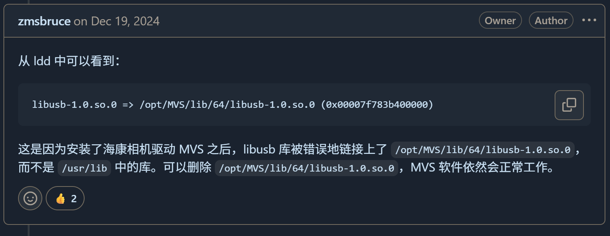

当前版本为派大星1.2.0

### 如何修改海康SDK导致的point_lio报错bug



先说解决办法    
>sudo rm /opt/MVS/lib/64/libusb-1.0.so.0


以下是哈基米的回答

> 好的，我们来分析一下您提供的ROS 2启动日志，并找出报错的原因。
> 
> 根据您提供的日志，有两个主要的错误信息，但**核心问题只有一个**。
> 
> -----
> 
> ### 核心错误分析
> 
> #### 1\. `pointlio_mapping` 节点崩溃 (直接原因)
> 
> 日志中有一条非常明确的错误信息：
> 
> ```bash
> [pointlio_mapping-9] /home/adam/ros_ws/install/point_lio/lib/point_lio/pointlio_mapping: symbol lookup error: /lib/x86_64-linux-gnu/libpcl_io.so.1.12: undefined symbol: libusb_set_option
> [ERROR] [pointlio_mapping-9]: process has died [pid 14213, exit code 127, cmd ...
> ```
> 
> **错误解读**:
> 
>   * **`symbol lookup error`**: 这是一个链接错误。意味着 `pointlio_mapping` 这个程序在运行时，需要调用一个名为 `libusb_set_option` 的函数，但是它在PCL（Point Cloud Library）的动态链接库 `libpcl_io.so.1.12` 中找不到这个函数的定义。
>   * **`undefined symbol: libusb_set_option`**: 这直接指出了找不到的函数名。这个函数通常属于 `libusb` 库，用于处理USB设备通信。
>   * **`exit code 127`**: 这个退出码通常表示"命令未找到"或相关的库加载/链接问题。
> 
> **根本原因**:
> 这个问题通常发生在**库版本不兼容**的情况下。具体来说，您系统中安装的PCL库在编译时，可能依赖于一个特定版本的 `libusb` 库，而您当前环境中存在另一个版本的 `libusb`，或者 `point_lio` 包在编译时链接的PCL版本与系统环境中的不一致。
> 
> 当 `pointlio_mapping` 启动时，它加载了 `/lib/x86_64-linux-gnu/libpcl_io.so.1.12`，而这个PCL库期望从 `libusb` 中找到 `libusb_set_option` 函数，但最终没有找到，导致程序崩溃。
> 
> -----
> 
> ### 如何解决 `pointlio_mapping` 崩溃问题
> 
> 解决这个问题的关键是**统一依赖库的版本**。
> 
> 1.  **清理并重新编译工作空间**: 这是最首要的步骤，可以解决大部分因缓存或旧编译产生的问题。
> 
>     ```bash
>     cd ~/ros_ws
>     rm -rf build install log
>     colcon build --symlink-install --packages-up-to point_lio
>     source install/setup.bash
>     ```
> 
>     `--packages-up-to` 会确保 `point_lio` 及其所有依赖包都被重新编译。
> 
> 2.  **检查 `libusb` 版本**:
>     确保您安装了 `libusb` 的开发库。
> 
>     ```bash
>     sudo apt update
>     sudo apt install libusb-1.0-0-dev
>     ```
> 
> 3.  **强制重装PCL和相关依赖**: 如果重新编译无效，可能是系统级的库出现了问题。
> 
>     ```bash
>     sudo apt update
>     sudo apt install --reinstall libpcl-dev ros-humble-pcl-*
>     ```
> 
>     完成后，**务必再次清理并重新编译您的工作空间**。
> 
> 4.  **检查环境变量**: 确保您的 `LD_LIBRARY_PATH` 环境变量没有指向一些冲突的库目录。通常情况下，您只应该 `source /opt/ros/humble/setup.bash` 和 `source ~/ros_ws/install/setup.bash`。可以通过 `echo $LD_LIBRARY_PATH` 来检查。
> 
> -----
> 
> ### 附加问题分析
> 
> #### 2\. TF 变换树断开 (次要问题，可能是由主问题引起的)
> 
> 日志中还出现了 `local_costmap` 无法激活的警告：
> 
> ```bash
> [local_costmap.local_costmap]: Timed out waiting for transform from gimbal_yaw_fake to odom to become available, tf error: Could not find a connection between 'odom' and 'gimbal_yaw_fake' because they are not part of the same tree.Tf has two or more unconnected trees.
> ```
> 
> **错误解读**:
> 
>   * **`Tf has two or more unconnected trees`**: 这是TF（坐标变换）系统的典型错误。它意味着您的机器人坐标系 `odom` 和 `gimbal_yaw_fake` 之间没有一个连续的变换链。
>   * **原因**: 通常，TF树的结构应该是 `map` -> `odom` -> `base_link` -> ... -> `gimbal_yaw_fake`。这个错误的出现，说明发布从 `odom` 到机器人主体（如 `base_link`/`chassis`）的节点没有正常工作。
> 
> **为什么这可能是由主问题引起的？**
> 负责发布 `odom` -> `base_link` 变换的节点很可能就是崩溃的 `pointlio_mapping` 节点，或者它依赖于 `pointlio_mapping` 的输出。因为**LIO-SLAM算法（如Point-LIO）的核心任务就是计算机器人的实时位姿，也就是 `odom` 到 `base_link` 的变换**。
> 
> 当 `pointlio_mapping` 节点崩溃后，这个关键的TF变换就中断了，导致导航系统中的 `local_costmap` 无法定位机器人，因此也无法启动。
> 
> ### 总结与行动计划
> 
> 1.  **首要目标**: 解决 `pointlio_mapping` 节点的 `symbol lookup error`。这是导致整个系统启动失败的根本原因。
> 2.  **行动步骤**:
>       * **第一步**：进入 `~/ros_ws`，执行 `rm -rf build install log` 清理工作空间。
>       * **第二步**：执行 `colcon build --symlink-install` 重新编译整个工作空间。
>       * **第三步**：如果问题依旧，尝试用 `apt` 重新安装 `libusb-1.0-0-dev` 和 `libpcl-dev`，然后再次清理并编译。
> 3.  **验证**: 当 `pointlio_mapping` 节点能够成功启动不再崩溃后，再次检查TF树的问题。大概率上，TF错误会随之消失。如果TF错误依然存在，您需要检查是哪个节点负责发布 `odom` 到 `base_link` 的变换，并排查该节点的问题。


### 如何修派大星行为树bug  

具体报错如图  


  


  


  